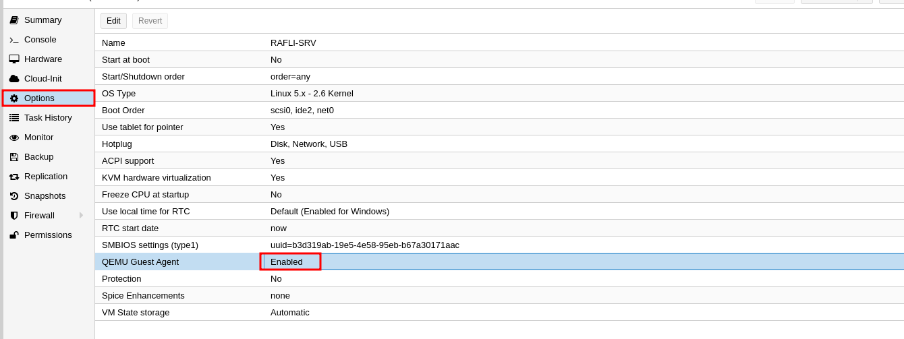
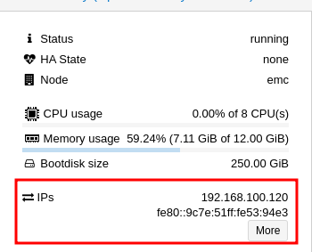

**QEMU Guest Agent** adalah program yang dijalankan di dalam Guest OS yang berjalan di bawah hypervisor QEMU/KVM. Fungsinya adalah untuk menyediakan berbagai informasi dan layanan terkait Guest OS kepada hypervisor atau manajemen Proxmox seperti menjalankan command pada guest.

Di Proxmox VE, QEMU Guest Agent menyediakan fitur-fitur berikut:

1. **Monitoring Sistem:**
    - QEMU Guest Agent memungkinkan Proxmox untuk memantau kesehatan dan kinerja sistem operasi tamu. Ini termasuk informasi tentang penggunaan CPU, memori, penyimpanan, dan network pada VM.
2. **Manajemen Daya:**
    - Dengan QEMU Guest Agent, Proxmox dapat mengelola daya pada VM. Ini termasuk mengizinkan Proxmox untuk mematikan, menangguhkan, atau me-reboot VM dengan aman. Di bandingkan dengan mengandalkan Command ACPI atau windows policy.
3. **Snapshot Konsisten:**
    - QEMU Guest Agent dapat bekerja sama dengan Proxmox untuk membuat snapshot dari Guest OS dalam kondisi yang konsisten. Ini memastikan bahwa snapshot yang dibuat tidak crash dan dapat restore dengan benar.
    - Untuk freeze guest file system saat membuat backup/snapshot (di windows, menggunakan volume shadow copy service VSS). Jika agen tamu diaktifkan dan berjalan, ia akan memanggil *guest-fsfreeze-freeze* dan *****guest-fsfreeze-thaw* untuk meningkatkan konsistensi.
    - Setelah snapshot atau freeze maka qemu akan menyinkronkan waktunya dengan hypervisor menggunakan qemu-guest-agent (sebagai langkah pertama).
4. **Backup dan Restore:**
    - Ketika digunakan bersama dengan software backup seperti Proxmox Backup Server, QEMU Guest Agent memungkinkan untuk membuat backup yang konsisten dari Guest OS dan kemudian merestore dengan benar.

## Installation

### 1. Enable Qemu-Guest-Agent on VM Proxmox
   
    
    

### 2. Install Package on linux VM

```bash
# Install Package
-> apt-get install qemu-guest-agent

# Start Package
-> systemctl start qemu-guest-agent

# Enable automatic after boot
-> systemctl enable qemu-guest-agent
```

### 3. Show after install
    Jika sudah selesai maka pada dashboard VM-Proxmox akan terlihat ip yang digunakan
    