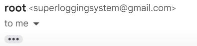

Postfix adalah suatu software open-source yang berfungsi sebagai MTA (Mail Transfer Agent) yang digunakan untuk mengirim, menerima, dan memfilter email, Cara Postfix berkomunikasi yakni menggunakan protocol SMTP.

Postfix berguna untuk send email ke mail server, contoh seperti mail company, gmail ataupun lainnya. 

## Setting Postfix

- Install dependencies
    
    ```bash
    apt update
    apt install -y libsasl2-modules mailutils
    ```
    
- Setting App Password pada Google Account jika menggunakan **gmail** (Optional)

[https://myaccount.google.com/apppasswords](https://myaccount.google.com/apppasswords)

- Set User & password email
    
    ```bash
    #Gmail
    echo "smtp.gmail.com your-email@gmail.com:YourAppPassword" > /etc/postfix/sasl_passwd
    
    #Mail server pribadi
    echo "mail.example.com your-email@example.com:YourPassword" > /etc/postfix/sasl_passwd
    ```
    
- Update permissions and hash the file
    
    ```bash
    chmod 600 /etc/postfix/sasl_passwd
    postmap hash:/etc/postfix/sasl_passwd
    
    #Check hash
    cat /etc/postfix/sasl_passwd.db
    ```
    
- Edit postfix config
    
    ```bash
    -> nano /etc/postfix/main.cf
    
    # google mail configuration
    relayhost = smtp.gmail.com:587
    
    # Mail server pribadi
    relayhost = mail.example.com:587
    smtp_use_tls = yes
    smtp_sasl_auth_enable = yes
    smtp_sasl_security_options =
    smtp_sasl_password_maps = hash:/etc/postfix/sasl_passwd.db
    smtp_tls_CAfile = /etc/ssl/certs/Entrust_Root_Certification_Authority.pem
    smtp_tls_session_cache_database = btree:/var/lib/postfix/smtp_tls_session_cache
    smtp_tls_session_cache_timeout = 3600s
    ```
    
- Reload Postfix
    
    ```bash
    postfix reload
    ```
    
- Test Send Email
    
    ```bash
    echo "This is a test message sent from postfix on my Proxmox Server" | mail -s "Test Email from Proxmox" user@gmail.com
    ```
    

## Change from name in email



Before


After

- install dependency
    
    ```bash
    -> apt update
    -> apt install postfix-pcre
    ```
    
- Edit config
    
    ```bash
    -> nano /etc/postfix/smtp_header_checks
    #mail isi hostname server yang sudah di setting di /etc/postfix/main.cf
    /^From:.*/ REPLACE From: pve1-alert <pve1-alert@pve.example.com>
    ```
    
- Hash the file
    
    ```bash
    -> postmap hash:/etc/postfix/smtp_header_checks
    
    #Check hash
    -> cat /etc/postfix/smtp_header_checks.db
    ```
    
- Add the module to postfix config
    
    ```bash
    nano /etc/postfix/main.cf
    
    #add to the end of the file
    smtp_tls_session_cache_timeout = 3600s
    smtp_header_checks = pcre:/etc/postfix/smtp_header_checks
    ```
    
- Reload Postfix
    
    ```bash
    postfix reload
    ```
    
- Test Send Email
    
    ```bash
    echo "This is a test message sent from postfix on my Proxmox Server" | mail -s "Test Email from Proxmox" user@gmail.com
    ```
    

Reference : 

- [https://technotim.live/posts/proxmox-alerts/](https://technotim.live/posts/proxmox-alerts/)