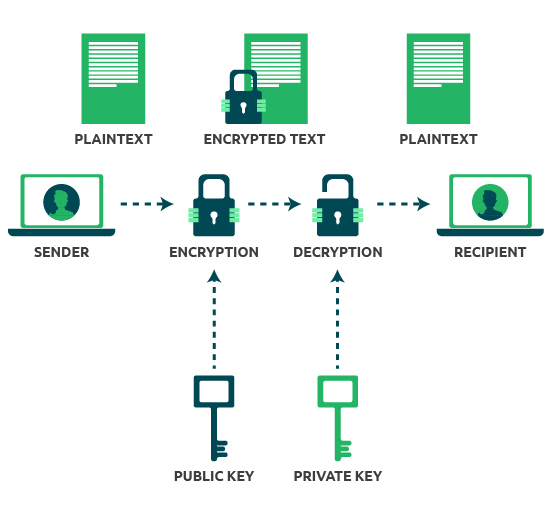

SSH (Secure Shell) mendukung autentikasi menggunakan password dan public key. Secara default, autentikasi yang digunakan adalah password. Namun, penggunaan public key dianggap lebih aman dan direkomendasikan, karena memberikan autentikasi yang lebih kuat dan mengurangi risiko serangan brute force terhadap password.

Public key authentication mengandalkan kriptografi kunci untuk mengizinkan user masuk tanpa memerlukan password. Proses ini melibatkan pembuatan sepasang kunci, yaitu Public Key dan Private Key. Public Key disimpan di server untuk memverifikasi identitas pengguna, sementara Private Key disimpan dengan aman di sisi klien dan digunakan untuk proses autentikasi.

## Work Flow

   

   1. **Pastikan public key sudah tersedia** untuk dapat mengenkripsi pesan yang akan dikirim.
      - **Public key pengirim** harus dimiliki oleh **penerima** untuk memverifikasi identitas pengirim (jika diperlukan).
      - **Public key penerima** harus dimiliki oleh **pengirim** untuk mengenkripsi pesan.
   2. Ketika pengirim ingin mengirimkan pesan, pengirim akan mengenkripsi pesan menggunakan **public key penerima**.
   3. **Penerima** kemudian akan mendekripsi pesan tersebut menggunakan **private key** yang dimilikinya. Hanya dengan private key penerima, pesan dapat dibuka dan dibaca.

   Note : Pesan **tidak akan bisa di baca** jika penerima tidak memiliki **private** **key**.

## Configuration

1. **Creating SSH Key**

   Create Public key and private key pada **user remote dan user server**.
      
      ```bash
      -> ssh-keygen
      Generating public/private rsa key pair.
      Enter file in which to save the key (/root/.ssh/id_rsa): #Enter
      Created directory '/root/.ssh'.
      Enter passphrase (empty for no passphrase): #Enter
      Enter same passphrase again: #Enter
      Your identification has been saved in /root/.ssh/id_rsa
      Your public key has been saved in /root/.ssh/id_rsa.pub
      The key fingerprint is:
      SHA256:5Iz9gB0wyFTGU0jIMIBL7wnMM9FpRmJECnDIU0HH2VY root@NODE-DOCKER
      The key's randomart image is:
      +---[RSA 3072]----+
      |XBOX=BOooE       |
      |**.**++=         |
      |=.*   ..o        |
      |.* .   O .       |
      |  = . o S        |
      |   o     o       |
      |          .      |
      |                 |
      |                 |
      +----[SHA256]-----+
      ```
    

2. **Copying your SSH Public Key to Server**

   Mengcopy public key user yang di pakai untuk ke Server remotenya. Public akan di copy ke user file  “.ssh/known_hosts”

   ```bash
   -> ssh-copy-id username@remote_host
   ssh-copy-id admin@192.168.1.1
   The authenticity of host '192.168.1.1 (192.168.1.1)' can't be established.
   ED25519 key fingerprint is SHA256:HgRqAWcCLqnd+NA3a6wAbgB6lmaNRaq5tKMiEeGW7hM.
   This key is not known by any other names
   Are you sure you want to continue connecting (yes/no/[fingerprint])? yes
   /usr/bin/ssh-copy-id: INFO: attempting to log in with the new key(s), to filter out any that are already installed
   /usr/bin/ssh-copy-id: INFO: 1 key(s) remain to be installed -- if you are prompted now it is to install the new keys
   admin@192.168.1.1's password: #Password

   Number of key(s) added: 1

   Now try logging into the machine, with:   "ssh 'admin@192.168.1.1'"
   and check to make sure that only the key(s) you wanted were added.
   ```

3. **Authenticating to Your Server Using SSH Keys**
    
    Remote server menggunakan SSH, jika berhasil maka tidak perlu memasukan password.
    
    ```bash
    -> ssh username@remote_host
    Welcome to Ubuntu 22.04.4 LTS (GNU/Linux .....
    
    #succeed
    
    ```
    
4. **Disabling Password Authentication on your Server**
    
    Mematikan authentication password maka untuk mengakses server hanya menggunakan public key yang sebelumnya sudah dikonfigurasi.
    
    ```bash
    > nano /etc/ssh/sshd_config
    .... #Rubah dan uncomment config pubkey auth to yes dan passwrd auth no
    PubkeyAuthentication yes
    
    PasswordAuthentication no
    ...
    
    > systemctl restart ssh
    ```
    
5. **Done**