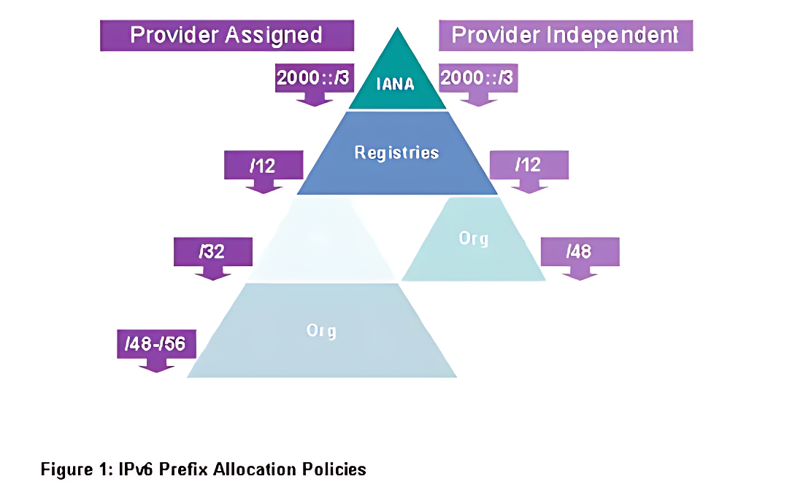
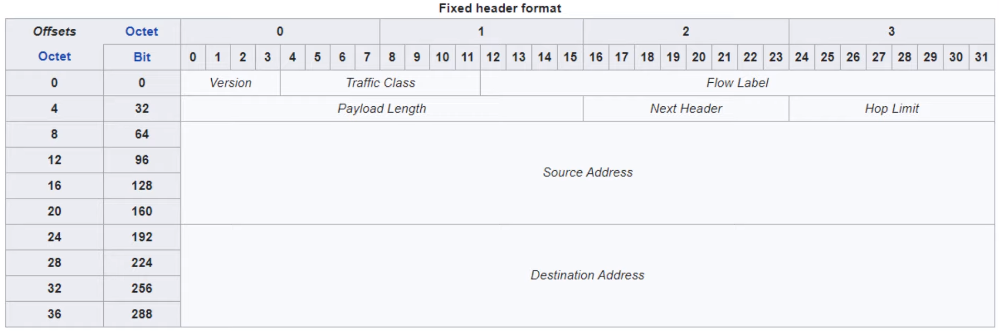
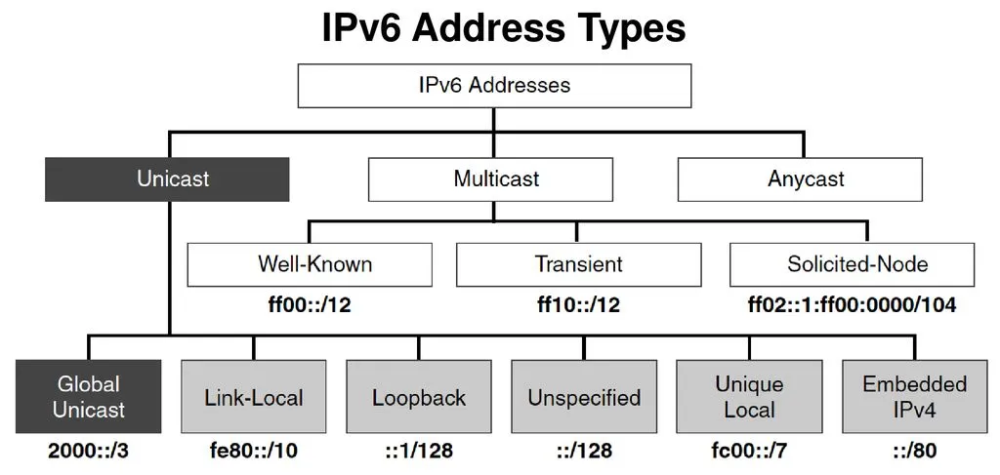
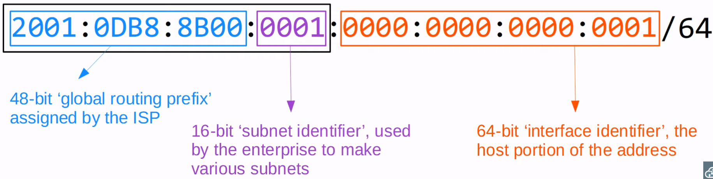
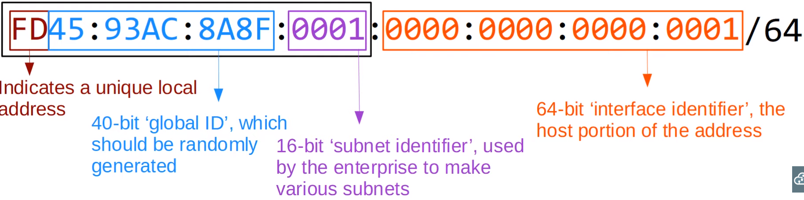
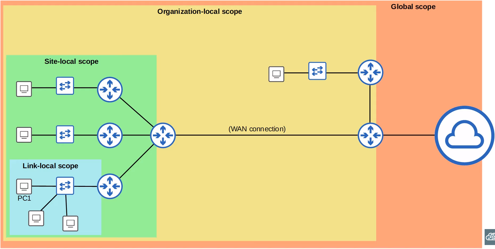
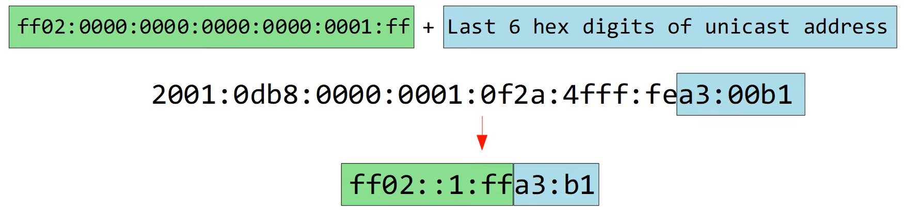

## Why IPv6  
⇒ IPv4 (IANA) yang tersedia sudah **tidak mencukupi**, karena sudah cukup lama mulai dari 1982 hingga sekarang yang pengunannya lebih dari 4 Milliar penduduk dunia. Maka dari itu dibutuhkan lah address baru untuk memenuhi kebutuhan internet di dunia yakni, IPv6. 

IPv4/IPv6 di distribusikan oleh IANA ke RIRs (Regional Internet Registries) ie. APNIC, AFRINIC, ARIN, LACNIC, RIPE NCC.

| IPv4 = 32 Bits | IPv6 = 128 Bits |
IPv4 = 4.294.867.296 (2 pangkat 32)  | IPv6 Hosts = 340.282.366.920.938.463.463.474.607.431.768.211.456 (340 undecilion) |

### **RFC 5952**  
⇒**“A Recommendation for IPv6 Address Text Representation,** Standard penggunaan IPv6 RFC 5952

- angka 0 didepan harus di remove
- :: harus digunakan untuk memperpendek **string terpanjang** dari all-0 quartets dan mempersingkat **all-0 quartets kiri** terlebih dahulu
- hexadecimal characters huruf, di tulis menggunakan lower-case (a) NOT upper-case (A) (tidak berpengaruh jika Upper Case)

### Provide IPv6  

- IANA membagikan Pool **/12** IPv6 ke Registries (APNIC, AFRINIC, ARIN, LACNIC, RIPE NCC)
- ISP/Companny akan menerima blok **ipv6 /32 atau /48** dari RIR distribute
- Jika Company/ISP ingin di distribusikan kembali maka bisa di berikan pool **/48 - /56**
- Untuk Mendistribusikan Subnet ipv6 ke hosts/device menggunakan **/64** prefix length.

### **IP Header IPv6**  
⇒ IPv6 Header jauh lebih mudah bagi router, sehingga kinerja secara umum meningkat

- Version (4bits) : menunjukan version IP. value version 6 (0b0110)
- Traffic Class (8Bits) : Used for QoS untuk menunjukan high-priority traffic. seperti IP Phone, Streaming.
- Flow Label (20Bits) : used to identify specific traffic ‘flows’ (communication between specific source and destination)
- Payload Length (16bits) : menunjukan panjang payload (encapsulated layer 4 segment) in bytes. panjang header ipv6 40 bytes.
- Next Header (8bits) : type ‘next header’ (header dari encapsulated segment), for example TCP/UDP. fungsi yang sama dengan IPv4 header ‘protocol’.
- Hop Limit (8bits) : nilai ini dikurangi 1 per 1 pada saat setiap router memforward. jika 0 akan didrop. same function IPv4 header “TTL”.
- Source Address (128bit) : source address packet
- Destination Address (128bit) : destination address packet

## IPv6 Address Types  

1. **Unicast (one to one)**
    - **IPv6 Global Unicast (ipv6 public)**   
        ⇒ IPv6 address dapat digunakan di internet seperti halnya public ipv4  
        Bit : 48 (3 collon first)  
        address range delegasi IANA : 2000::/3
        
        **Fungsi Global Unicast**
        - identification interface on ipv6 device
        - include dengan link-local dan loopback address pada saat dibuat unicast
                
        
            
    - **Unique Local Address (IP Private)**   
        ⇒ communication between subnets and **cannot route on the Internet**, used for **internal private network**  
        fc00::/7 (11111100)  
        fc00::/8, fd00::/8, fe00::/8

        Note:
        - Update **terbaru mengharuskan** **bit ke 8** di set ke 1, jadi **FD**
        - **Global ID**, harus unik dan random agar tidak overlap saat perusahaan bergabung.
        
        
        
    - **Link Local Address**  
        ⇒ Link-local di generete secara otomatis pada saat enable IPv6 on router dan interface  
        address = fe80::/10
        
        Note:
        - Standardnya 54bit setelah fe80/10 harus 0, jadi only FE8
        - Interface ID di **generete using EUI-64**
        - Tidak dapat dijadikan **destination network** dan **will not route**
        - only 1 subnet, yakni fe80::/10
            - Fungsi Link local
                - Routing Protocol Peering (OSPFv3 uses link-local for neighbore adjancencies)
                - Berfungsi sebagai gateway/hop for static route
                - Neighbore Discovery Protocol (NDP, pengganti ARP ipv6), berguna agar link-local addres berfungsi
                - Konfigurasi link-local satu interface satu address
            - Configure
                - `ipv6 enable`  
                    ⇒ enable ipv6 on interface
                - `ipv6 route 2001:db8:0:1::/64 g0/0 fe80::201:63ff:feb0:b801`  
                    ⇒ ip route use **next-hop** **Link-local and interface (Fully Specified).**

2. **Multicast Address (one-to-many)**  
    Address : ff00::/8 (General Multicast)
    
    **IPv6 Multicast Scopes**, => seberapa jauh packet mulitcast di forward.
    - **Interface-local (FF01)**  
    ⇒ Packet **doesn’t leave dari local device**. hanya digunakan untuk traffic yang berjalan dalam local device.
    - **Link-local (FF02)**  
    ⇒ Packet **tetap dalam local subnet** dan tidak dirutekan antar subnet, can be used to send a message to hosts connected to the local link.
    - **Site-local (FF05)**  
    ⇒ packet **can be forwarded by routers**. tetapi data tersebut dilimit pada single pyhsical location (**not forwarded** melalui **WAN**)
    - **Organization-local (FF08)**  
    ⇒ berfungsi agar **cakupannya (scope) lebih luas** dibandingkan multicast site-local (seluruh company/organization).
    - **Global (FFOE)**  
    ⇒ Address ini **tidak ada batasan** dan **lebih luas dari organizaion-local** dan dapat **diroute melalui public internet**.
    
    
    
3. **Anycast Address (one-to-one-of-many)**  
    ⇒ Menetapkan **ipv6 yang sama** **di multiple device (router)** yang berbeda tetapi tidak bentrok, melainkan akan **di arahkan ke perangkat terdekat.**

    **No Specific Address** range for anycast addresses.  
    - Cara Kerja
        - Add ip anycast ke multiple device (router)
        - Host route akan meng advertise addressnya ke router lain.
        - ketika host send packet to destination address, router akan forward ke router terdekat yang dikonfigurasi dengan ip address yang sama (sama routeing metric)
    - Function
        - Ditugaskan ke lebih dari satu interface
        - Digunakan secara eksklusif oleh perangkat non-host, biasanya server
    - Configuration   
        `ipv6 address 2001:db8:1:1::99/128 anycast`   
        ⇒ set ip address di multiple device

## IPv6 Delegation Mechanism
1. **Stateless Mechanism**  
    ⇒ Metode di mana device dalam jaringan dapat mengonfigurasi alamat IP mereka sendiri tanpa bantuan server DHCPv6. Proses ini disebut **SLAAC** (Stateless Address Autoconfiguration). Device menggunakan informasi yang dikirim oleh router melalui **Router Advertisement (RA)** untuk membentuk alamat IP.
    
2. **Stateful Mechanism**    
    ⇒ Stateful Mechanism menggunakan **DHCPv6** (Dynamic Host Configuration Protocol for IPv6) dan **DHCPV6 Client** untuk konfigurasi IP dan informasi network lainnya. Dalam mekanisme ini, DHCPv6 server menyediakan alamat IP secara dinamis, Mendelegasikan Prefix Pool, serta informasi tambahan seperti DNS server dan domain search.
    
    **Cara kerja**  
    - Perangkat IPv6 mengirimkan permintaan ke server DHCPv6 untuk mendapatkan alamat IP dan konfigurasi lainnya.
    - Server DHCPv6 kemudian memberikan alamat IP yang tersedia dan informasi jaringan lainnya seperti DNS.
    - Dalam stateful mechanism, server DHCPv6 mencatat alamat IP yang telah diberikan ke perangkat (stateful) dan menjaga status ini untuk menghindari konflik IP.

## **IPv6 EUI-64 (Extended Unique Identifier)**  
⇒ Method converting MAC Address (48-bit) to 64-bit interface for hosts, Combine Mac Address with FFFE in the middle. so, 64-bit network and 64-bit host.

- Why Convert 7th bit
    - Type MAC Address
        - UAA (Universally Administered Address)  
        ⇒ Unique MAC Addres yang di assigned by the manufacture (perusahaan)
        - LAA (Locally Administered Address)  
        ⇒ manual assigned by admin or protocol (`mac-address` configure manual interface)
    - Identify UAA and LAA
    ⇒ Identifikasi berdasarkan **7th bit** MAC address, yang disebut **U/L bit** (Universal/Local)
        - U/L bit set 0 = UAA
        - U/L bit set 1 = LAA
    - Konteks dari EUI-64 terbalik.
        - U/L bit set to 0 = MAC Addres yang telah di convert EUI-64 LAA
        - U/L bit set to 1 = MAC Addres yang telah di convert EUI-64 UAA
- Calculate
    1. Split Mac Address in to two ( 00:BB:CC | DD:11:22)
    2. Insert FFFE Hexa in the middle   
     Eg: 00:BB:CC:DD:11:22 --> 00BB:CCFF:FEDD:1122
    3. Invert the 7th Bit of the MAC address (0 to 1)   
    ⇒ 0**0** → 0b0000 00**0**0 (Binary)   
    ⇒ 0b0000 0010 → 0x02 (invert 7th)
    4. Finally, 02BB:CCFF:FEDD:1122
- Configuration   
`ipv6 address 2001:db8::/64 eui-64`

## SLAAC (Stateles Address Auto-Configuration)
⇒ Metode otomatis dalam konfigurasi alamat IPv6 yang memungkinkan perangkat untuk secara otomatis mendapatkan alamat IP tanpa perlu konfigurasi manual atau server DHCP. SLAAC bekerja dengan memanfaatkan **Router Advertisement (RA)** yang dikirim oleh router pada jaringan lokal.

1. **Host Mengirimkan Router Solicitation (RS)**   
    meminta informasi dari router yang ada di jaringan tentang konfigurasi address dan informasi network.

2. **Router Mengirimkan Respon Router Advertisement (RA)**   
    pesan yang berisi informasi penting seperti **prefix (awalan)** jaringan, **lifetime (masa hidup)**, dan instruksi apakah host harus menggunakan SLAAC atau konfigurasi lainnya seperti DHCPv6.

3. **Host Membentuk Alamat IPv6 Unik**
    - **Prefix**: Bagian jaringan yang diberikan oleh router melalui RA.
    - **Interface Identifier (IID)**: Bagian unik yang dihasilkan oleh host untuk mengidentifikasi dirinya. IID biasanya dihasilkan dari **MAC address** atau EUI-64 dan bisa juga dengan metode **Randomized Identifier** untuk meningkatkan privasi.

4. **Host Mengecheck Duplikat Address Detection (DAD)**  
    Host menjalankan **Duplikat Address Detection (DAD)** untuk memastikan bahwa alamat IPv6 yang baru dibentuk tidak ada yang sama. 
    
5. **Host Dapat Mulai Menggunakan Alamat IPv6**  
    Host dapat menggunakan alamat IPv6 yang telah dikonfigurasi. Host mendapatkan informasi terkait DNS, Gateway dari RA.
    

## NDP (Neighbore Discovery Protocol)  
⇒ Protocol sejenis ARP pada IPv4, tetapi jika pada IPv6 menggunakan Protocol **NDP**. NDP menggunakan ICMPv6 dan Solicated-node Multicast address for learn MAC Address of other hosts. Melalu NDP ini device akan terdeteksi sebagai **Host** atau **Router**.

- Message Types
    1. Neighbor Solicitation (NS) = ICMPv6 Type 135
    2. Neighbor Advertisement (NA) = ICMPv6 Type 136  
    ⇒ sama dengan NDP Reply ARP.
- Cara Kerja NDP  
    Case: R1 mengetahui IPv6 R2 tetapi tidak MAC Addressnya

    1. Maka R1 mengirimkan Message NDP, Packet yang dikirimkan yaitu **NS (Neighbor Solicitation)** dengan detail packet :  
    Source IP : R1 G0/0 IP   
    Destination IP : R2 Solicited-node Multicast   
    Source MAC : R1 G0/0 MAC  
    Destination MAC : Multicast MAC R2 solicited-node  
    Note:  
    IPv6 NDP tidak membroadcast tetapi unicast, jadi melihat dari **Solicated-node** berdasarkan **IP Unicast** pada saat ping karena **R1 mengetahui IPv6 R2**. misal `ping 2001:db8::78:9abc` > `ff02::1:ffa3:00b1` (solicated-node)

    2. **Reply packet NS**, dengan packet **NA (Neighbor Advertisement)**. detail packet:  
    Source IP : R2 G0/0 IP  
    Destination IP : R1 G0/0 IP  
    Source MAC : R2 G0/0 MAC  
    Destination MAC : R1 G0/0 MAC

    3. Lalu di masukan ke dalam **Neighbore Table**  
    `show ipv6 neighbore` (Global Unicast & Link-local)

- **Solicated-node Multicast**  
    ⇒ Multicast node ini di hitung dari unicast address **last 6 hex digits**.  
    check ipv6 multicast node `sh ipv6 int g0/0`
    
    
    

### DAD (Duplicate Address Detection)  
Proses pada IPv6 yang digunakan untuk memastikan bahwa alamat IP yang dikonfigurasi pada suatu host tidak digunakan oleh device lain di jaringan. DAD adalah bagian dari protokol **Neighbor Discovery Protocol (NDP)** dan berfungsi untuk menghindari konflik alamat pada jaringan.

**Cara Kerja**  
1. **Membentuk Alamat IPv6**  
    Setelah host membentuk alamat IPv6, baik melalui **SLAAC** atau cara lain, alamat tersebut belum langsung digunakan sebelum dipastikan unik melalui proses DAD.
2. **Mengirimkan Neighbor Solicitation (NS)**
    - Host mengirimkan pesan **Neighbor Solicitation (NS)** ke alamat **Solicited-Node Multicast Address** yang terkait dengan alamat IPv6 yang ingin digunakan menggunakan ip multicast **`ff02`**.
    - Pesan ini meminta perangkat lain di jaringan untuk memberi tahu jika ada yang sudah menggunakan alamat tersebut.
    - Contoh: Jika host ingin menggunakan alamat IPv6 **2001:db8::1**, ia akan mengirim NS ke multicast address **ff02::1:ff00:1**.
3. **Menunggu Neighbor Advertisement (NA)**
    - Host menunggu **Neighbor Advertisement (NA)** dari perangkat lain. Jika perangkat lain mengirimkan respons NA, maka address sudah digunakan, dan host harus membuat address baru.
    - Jika **tidak ada NA yang diterima**, artinya tidak ada perangkat lain yang menggunakan alamat tersebut, dan host dapat menggunakan alamat IPv6 tersebut dengan aman.
4. **Menggunakan Alamat IPv6**
    - Jika proses DAD berhasil (tidak ada respons), host akan mulai menggunakan alamat tersebut.

### Router Solicitation/Advertisement  
⇒ fungsi lain NDP untuk menemukan router di network local secara automatic. ip neighbore
- Messages
    1. Router Solicitation (RS) = ICMPv6 Type 133
        - sent to multicast address FF02::2 (all routers)
        - Message ini meminta router pada link-local local network, untuk identifikasi dirinya.
        - message ini di send pada saat interface enable or host connected.
    2. Router Advertisement (RA) = ICMPv6 Type 134
        - Sent to multicast address FF02::1 (all node)
        - router akan mengumumkan kehadirannya dan memberikan information link local network.
        - Respon dari RS Messages. jika router tidak menerima RS, router tetan sent RA.
- Cara Kerja
    1. R1 enable G0/0, maka R1 akan mengirimkan RS untuk menanyakan apakah ada router di link ini?
    2. R2 akan menjawab message RS dengan RA