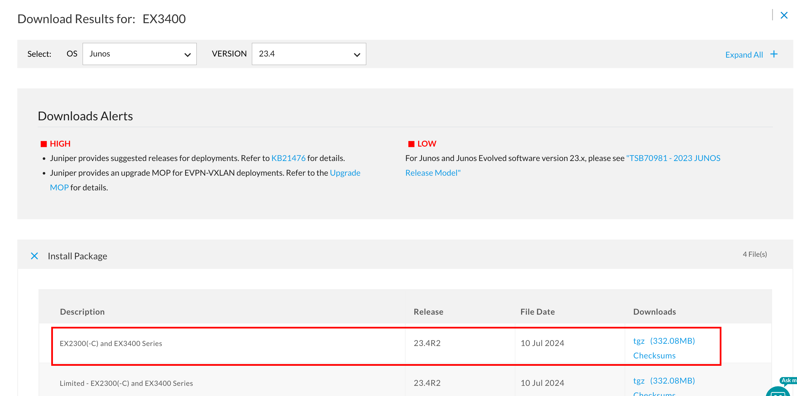
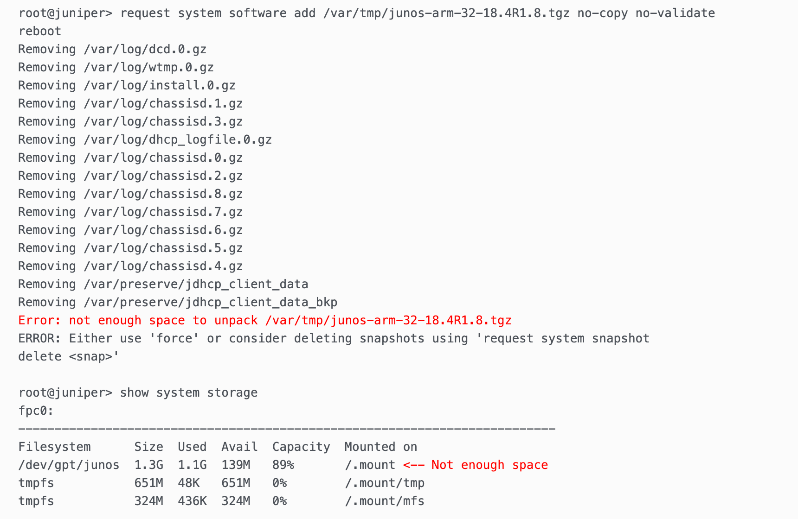

Untuk melakukan upgrade firmware **Juniper** (router atau switch), Anda harus mengikuti langkah-langkah berikut dengan hati-hati. Upgrade firmware di perangkat Juniper biasanya dilakukan melalui **Junos OS** yang merupakan sistem operasi perangkat tersebut.

Upgrade Firmware ini dapat di jalankan pada switch yang telah dibuat **virtual-chassis/Stacking**

Jika device yang akan di upgrade sudah jauh dengan version yang ada sekarang, maka os yang harus di install harus mulai dari os yang terdekate terlebih dahulu. Misal versi Skrang 12 maka install ke versi 15/18 terlebih dahulu lalu lanjutkan ke versi lainnya.

## Requirements

- Flashdisk (Kosongan), Biasanya Switch baru
- Console

## Upgrade

1. Download Firmware pada website juniper [https://support.juniper.net/support/downloads](https://support.juniper.net/support/downloads/), pilih Seri Device yang ingin di upgrade, pilih OS “Junos” dan Version yg di inginkan dengan format .tgz.  
    
    Pastikan sudah memiliki account Juniper yang mendapatkan hak akses untuk download software. 

    

2. Upload firmware to Juniper
    1. Via Flashdisk
        - Pastikan Firmware sudah dicopy ke FD, lalu di colok pada belakang switch/router
        - Masuk ke shell Juniper via SSH/Console
        - check `ls /dev/da*` apakah sudah terbaca FD “`/dev/da1s1`”
        - `mkdir /var/tmp/usb`, buat folder untuk mo
        - `mount_msdosfs /dev/da1s1 /var/tmp/usb`, Agar file pada FD dapat di akses
        - `cp /var/tmp/usb/junos* /var/tmp`, Copy file package agar bisa di baca oleh juniper
    2. Via FTP/SCP
        - Pastikan Device sudah memiliki IP untuk transer file
        - Buka apps Winscp(SCP) / Filezila (FTP) untuk transfer File
        - Jika menggunakan FTP maka aktifkan terlebih dahulu Servicenya, `set system services ftp`
        - Transfer file ke direktori `/var/tmp`
3. Masuk ke Mode Operation “`cli`” lalu jalankan perintah ini
    
    ```bash
    request system software add /var/tmp/junos-arm-32-21.1R1.11.tgz reboot
    
    ##or
    
    request system software add /var/tmp/junos-arm-32-21.1R1.11.tgz reboot no-validate
    ```
    
    - **`reboot`** memastikan perangkat di-restart secara otomatis setelah proses instalasi package selesai, sehingga versi baru dari Junos langsung dijalankan.
    - **`no-validate`** melewati proses validasi, yang mempercepat instalasi tetapi dengan risiko tidak terdeteksinya masalah pada file image yang di-install. Recomend jika image yang telah di download dari sumber terpercaya dan pastinya aman.
3. `request system reboot`, Jika system telah selesai di install dan tidak auto reboot.
4. Setelah reboot versi baru akan langsung di jalankan.

## Troubleshoot

**Not enough storage while upgrading Junos EX2300 and EX3400**



[CEC Juniper Community](https://supportportal.juniper.net/s/article/EX-Not-enough-storage-while-upgrading-Junos-EX2300-and-EX3400?language=en_US)

## References

[SOLVED: VIDEO: Step By Step Firmware Upgrade Process For Juniper EX3400 Switch](https://www.urtech.ca/2021/07/solved-video-step-by-step-firmware-upgrade-process-for-juniper-ex3400-switch/)