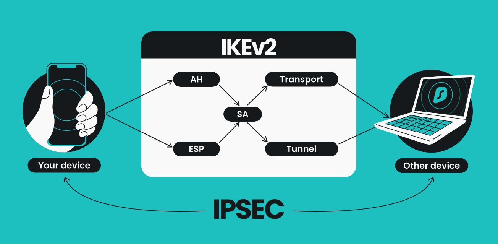
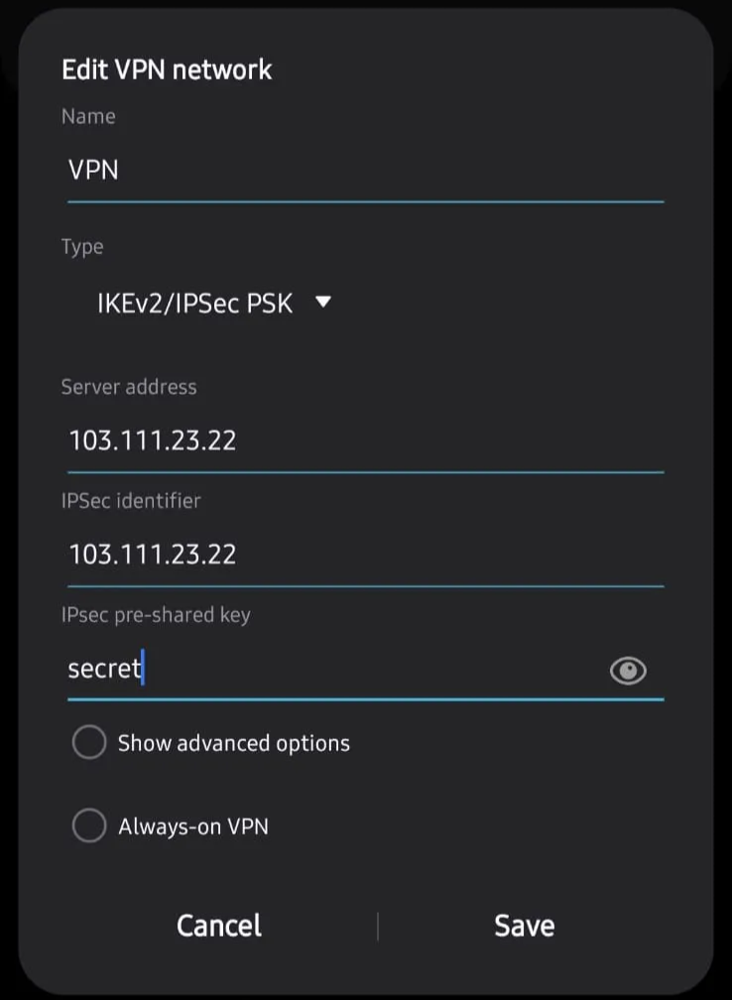

IPsec (Internet Protocol Security) dan IKEv2 (Internet Key Exchange version 2) adalah dua teknologi yang sering digunakan pada device terbaru untuk membuat koneksi Virtual Private Network (VPN) yang aman.

## Introduction

1. **IKEv2 (Internet Key Exchange version 2) - Security**
    
    Protokol ini berfungsi untuk pertukaran cryptographic key yang digunakan dalam pengaturan koneksi VPN yang aman, terutama pada protokol **IPsec**. IKEv2 bertanggung jawab untuk membuat, mengelola, dan memelihara “tunnel” VPN antara client dan server. Protokol ini merupakan peningkatan dari **IKEv1** dan telah dirancang untuk menawarkan lebih banyak kecepatan, keamanan, dan stabilitas dalam koneksi VPN.
    
    **Fungsi Utama IPsec:**
    
    - **Negosiasi Cryptographic Key,** IKEv2 digunakan untuk melakukan negosiasi kunci antara dua entitas (klien dan server VPN). Ini memungkinkan kedua belah pihak untuk menetapkan kunci sesi yang digunakan untuk enkripsi data dalam komunikasi.
    - **Authentication,** IKEv2 memastikan bahwa kedua belah pihak yang berkomunikasi adalah sah melalui proses otentikasi. Otentikasi dapat dilakukan melalui sertifikat digital, pre-shared key (PSK), atau metode otentikasi lain.
    - **Managing IPsec Sessions,** IKEv2 secara dinamis membuat dan mengelola sesi aman (tunnel) IPsec antara klien dan server. Setiap kali sesi VPN dibuka, IKEv2 bertugas untuk mengelola parameternya (seperti algoritma enkripsi, otentikasi, dan kunci sesi).
    - **Tahan terhadap Perubahan Network**
    Salah satu keunggulan utama IKEv2 adalah kemampuannya untuk mendukung **mobilitas** dan **multihoming**. pada saat perangkat berpindah dari satu jaringan ke jaringan lain (misalnya dari Wi-Fi ke 4G), maka koneksi tetap aman tanpa memutus sesi VPN.
    - **Keamanan Tinggi,** 
    IKEv2 mendukung berbagai algoritma enkripsi dan otentikasi yang sangat kuat, seperti AES (Advanced Encryption Standard) untuk enkripsi dan SHA (Secure Hash Algorithm) untuk integritas. Protokol ini juga tahan terhadap serangan seperti man-in-the-middle dan replay attack.
    
2. **IPsec (Internet Protocol Security) - Tunnel**
    
    IPsec adalah protokol yang menyediakan keamanan untuk komunikasi di jaringan IP. Ini bekerja pada network layer (layer 3) untuk membuat jalur tunnel dan bertanggung jawab untuk memastikan bahwa data yang dikirim melalui jaringan aman, baik public atau private.
    
    **Fungsi Utama IPsec:**
    
    - **Kerahasiaan (Confidentiality)**: IPsec menggunakan enkripsi untuk melindungi data agar tidak dapat dibaca oleh pihak ketiga yang tidak diotorisasi. Ini memastikan bahwa pesan yang dikirimkan tetap rahasia.
    - **Integritas (Integrity)**: IPsec memastikan bahwa data yang diterima adalah asli dan tidak diubah selama pengirimannya melalui jaringan. Setiap paket data diperiksa untuk memastikan tidak ada perubahan atau manipulasi yang terjadi.
    - **Otentikasi (Authentication)**: IPsec menyediakan mekanisme untuk mengautentikasi sumber dari data yang dikirim, sehingga penerima dapat memastikan bahwa pengirim data adalah pihak yang sah.
    - **Anti-Replay**: IPsec memiliki fitur yang mencegah serangan "replay", di mana penyerang mencoba mengirim ulang paket data yang valid dengan tujuan jahat.

## Work Flow



### **Fase 1: Key Creation and Negotiation - IKEv2**

IKEv2 melakukan pertukaran kunci dan Authentication antara klien dan server untuk membuat jalur komunikasi aman.

1. **Connection Initiation (IKE_SA INIT)**
    - **Langkah 1: Start VPN client connection.**

        Client dan server menegosiasikan algoritma security yang akan digunakan untuk encryption, data integrity, dan authentication.  
        Contoh algoritma enkripsi: AES (Advanced Encryption Standard).  
        Contoh algoritma otentikasi: SHA (Secure Hash Algorithm).
        
    - **Langkah 2: Diffie-Hellman key exchange.**

        Kunci kriptografi dibuat menggunakan algoritma Diffie-Hellman, yang memungkinkan klien dan server membuat kunci enkripsi secara aman tanpa harus mengirimkan kunci itu langsung melalui jaringan. Setiap pihak membuat kunci sesi bersama yang hanya diketahui oleh mereka.
        
2. **Authentication (IKE_AUTH)**
    - **Langkah 3: Otentikasi klien dan server.**

        Setelah pertukaran kunci selesai, kedua belah pihak (klien dan server) saling **mengotentikasi** untuk memastikan bahwa mereka adalah pihak yang sah.  
        Proses otentikasi ini dapat dilakukan menggunakan:  
        - **Sertifikat digital** (misalnya, **sertifikat X.509**), atau
        - **Pre-shared key (PSK)**, yaitu kunci rahasia yang telah dibagi sebelumnya.
    - **Langkah 4: Building a secure tunnel (IPsec Security Association - SA).**

        Setelah negosiasi, **IKEv2** membangun **Security Association (SA)**, yang mendefinisikan parameter keamanan untuk sesi IPsec, termasuk apakah akan menggunakan **AH** atau **ESP**.  
        Setelah tunnel VPN terbentuk, data yang ditransfer dilindungi oleh **IPsec** dengan menggunakan protokol **AH atau ESP**, tergantung pada kebutuhan.

### **Fase 2: Transfer Data - IPsec**
Data mulai dikirimkan melalui tunnel VPN yang telah terbentuk. Protokol **IPsec** bertanggung jawab untuk mengenkripsi, mengotentikasi, dan melindungi integritas data yang ditransmisikan.

1. **Encryption and Data Transmission**
    - **Langkah 5: Transfer data terenkripsi menggunakan protokol IPsec.**  
        Semua data yang dikirim dari klien ke server dienkripsi menggunakan protokol IPsec. IPsec dapat bekerja dalam dua mode:
        - **Tunnel Mode**: Mode ini mengenkripsi seluruh paket IP, termasuk header dan payload, sehingga identitas pengirim dan penerima juga disembunyikan.
        - **Transport Mode**: Hanya payload (isi) dari paket IP yang dienkripsi, sedangkan header tetap terlihat.
        
        **Protokol AH (Authentication Header)** dan/atau **ESP (Encapsulating Security Payload)** digunakan untuk melindungi data:  
        - **AH**: Memberikan otentikasi dan integritas data, tetapi tidak mengenkripsi data.
        - **ESP**: Mengotentikasi sekaligus mengenkripsi data untuk melindungi kerahasiaannya.
2. **Data Decryption and Reception**
    - **Langkah 6: Dekripsi data di sisi server.**

        Server VPN menerima paket yang dienkripsi dengan **ESP** atau diotentikasi dengan **AH**. Paket kemudian dideskripsikan menggunakan **key** yang disepakati selama negosiasi IKEv2.  
        Setelah dekripsi berhasil, data diteruskan ke tujuan akhirnya, seperti situs web atau layanan yang diakses pengguna.
        
3. **Data Integrity Verification**
    - **Langkah 7: Memeriksa integritas paket.**     

        IPsec memeriksa apakah data telah dimodifikasi selama pengiriman. Algoritma hash (seperti **SHA**) digunakan untuk memastikan integritas data. Jika hash tidak cocok, paket dianggap rusak dan akan ditolak.
        
4. **Rekeying (Pembaruan Kunci)**
    - **Langkah 8: Pembaruan kunci sesi.**

        Setelah sesi berlangsung untuk waktu tertentu atau setelah jumlah data tertentu ditransfer, **IKEv2** melakukan **rekeying**, yaitu pembaruan kunci sesi. Ini penting untuk menjaga keamanan koneksi dalam jangka panjang.
        
5. **Connection Closing (Terminating Session)**
    - **Langkah 9: Menutup sesi VPN.**

        Ketika klien selesai menggunakan VPN, sesi VPN ditutup. **IKEv2** kemudian menghapus parameter keamanan dan kunci sesi untuk mencegah potensi kebocoran atau eksploitasi di masa mendatang.
        

## Topology Example


Ketika Client ingin mengakses device di kantor (server/printer) teknologi yang sering digunakan adalah VPN. Namun, saat ini beberapa perangkat tidak lagi mendukung VPN L2TP/PPTP karena dianggap tidak aman untuk digunakan. Oleh karena itu, salah satu VPN yang dapat digunakan adalah **IPSec/IKEv2**, yang menawarkan tingkat keamanan lebih tinggi dibandingkan VPN-VPN sebelumnya.

## Configuration Server


1. **IP Pool**
    
    
    
    ```bash
    /ip pool
    add name=pool-vpn ranges=172.16.1.100-172.16.1.200
    ```
    
    - **Fungsi**: Membuat kumpulan (pool) IP yang akan diberikan kepada klien VPN saat mereka terhubung. (IP private bebas)
    - **Penggunaan**: Klien yang terhubung melalui VPN akan diberikan salah satu IP dari rentang ini, sehingga mereka dapat berkomunikasi melalui jaringan VPN.
2. **IPSec Mode-Config**
    - **Fungsi**: Mengatur bagaimana IP dan DNS diberikan ke client VPN melalui protokol IPSec.
    
    
    
    ```bash
    /ip ipsec mode-config
    add address-pool=pool-vpn address-prefix-length=32 name=vpn_ip-ikev2
    ```
    
    - **Rincian**:
        - `address-pool=pool-vpn`: Mengatur agar klien mendapatkan IP dari pool yang bernama `pool-vpn`.
        - `address-prefix-length=32`: Menetapkan klien VPN hanya mendapatkan satu alamat IP (subnet mask 32-bit).
        - `system dns`, Jika di check maka DNS akan mengikuti router vpn dan jika di uncheck maka DNS akan mengikuti provider yang di pakai oleh client
3. **IPSec Proposal**
    
    **Fungsi**: Menentukan parameter enkripsi dan autentikasi yang digunakan selama negosiasi IPSec.
    
    <p align="center" width="100%">
    
    </p>

    ```bash
    /ip ipsec proposal
    add auth-algorithms=sha256,sha1 enc-algorithms=aes-256-cbc name=ikev2-proposal pfs-group=modp2048
    ```
    
    - **Rincian**:
        - `auth-algorithms=sha256,sha1`: Algoritma autentikasi yang digunakan adalah SHA-256 dan SHA-1. Algoritma ini digunakan untuk memastikan bahwa data yang dikirimkan tidak diubah dalam perjalanan.
        - `enc-algorithms=aes-256-cbc`: Algoritma enkripsi yang digunakan adalah AES-256 dalam mode CBC (Cipher Block Chaining). Algoritma enkripsi ini akan digunakan untuk mengenkripsi data yang ditransfer melalui VPN, sehingga data tersebut tidak bisa dibaca oleh pihak yang tidak berwenang.
        - `pfs-group=modp2048`:  Perfect Forward Secrecy (PFS) Grup Diffie-Hellman yang digunakan adalah **modp2048** (Modular Exponentiation Group dengan kunci 2048-bit).
            
            **Modp2048**: Grup Diffie-Hellman ini memiliki tingkat keamanan yang sangat tinggi. PFS memastikan bahwa setiap sesi VPN menggunakan kunci yang berbeda, sehingga jika kunci satu sesi diretas, kunci sesi lain tetap aman.
            
        - `lifetime` : Lifetime menentukan berapa lama sesi akan tetap aktif dan pada saat habis, key akan di negosiasi ulang.
4. **IPSec Group**
    
    **Fungsi**: mengelompokkan konfigurasi seperti **proposals** dan **policies,** yang terkait dengan IKEv2.
    
    
    
    ```bash
    /ip ipsec policy group 
    add name=ikev2-group
    ```
    
5. **IPSec Profile**
    
    **Fungsi**: Menetapkan profil yang mengatur parameter enkripsi dan hash untuk peer IPSec pada sesi IKE (Internet Key Exchange).
    
    
    <p align="center" width="100%">
    
    </p>

    ```bash
    /ip ipsec profile
    add enc-algorithm=aes-256 hash-algorithm=sha256 name=ipsec-ikev2-profile
    ```
    
    - **Rincian**:
        - `hash-algorithm=sha256`: Menggunakan SHA-256 untuk autentikasi data.
        - `prf-algorithm=auto` : **PRF (Pseudorandom Function)** digunakan untuk menghasilkan kunci sesi berdasarkan masukan yang dihasilkan selama fase pertukaran kunci. `auto` biasanya diselaraskan dengan algoritma hash (SHA256).
        - `enc-algorithm=aes-256`: Menggunakan AES-256 untuk enkripsi data.
        - `DH Group` : **DH Group (Diffie-Hellman Group)** adalah set parameter yang menentukan kekuatan algoritma pertukaran kunci Diffie-Hellman
        - `proposal-check=obey` : Pengaturan ini mengontrol bagaimana profil untuk memeriksa kesesuaian proposal IPsec (yang menentukan algoritma enkripsi, hashing, dan PFS) dari peer.
            
            `Obey` akan selalu mengikuti proposal yang diajukan oleh peer (klien atau server). 
            
        - `Lifetime=1d 00:00:00` : **Lifetime** menentukan berapa lama sesi IKEv2/IPsec akan aktif sebelum sesi perlu diperbarui (rekeying)
        - `NAT Traversal=check` : Dengan cara ini, perangkat di belakang NAT bisa tetap membuat koneksi **VPN IPsec** yang aman tanpa terganggu oleh perubahan alamat IP atau nomor port yang dilakukan oleh perangkat NAT
        - `DPD Interval: 120` : **Interval 120** berarti akan mengirim pesan **DPD (Dead Peer Detection)** setiap 120 detik (2 menit) untuk memverifikasi bahwa peer masih terhubung. Jika tidak ada respon, ini menunjukkan bahwa koneksi sudah mati atau gagal.
        - `DPD Maximum Failures: 5` : setelah **5 kali** kegagalan berturut-turut dalam menerima tanggapan DPD dari peer, Mikrotik akan menganggap koneksi telah gagal, dan sesi IPsec akan dihentikan.
6. **IPSec Policy**
    
    **Fungsi:** Kebijakan ini menentukan lalu lintas mana yang akan di-enkripsi atau diautentikasi, menggunakan **IPsec Proposal** yang sudah diatur
    
    
    
    
    
    ```bash
    /ip ipsec policy
    add group=ikev2-group proposal=ikev2-proposal template=yes
    ```
    
    - **Rincian**:
        - `Src. Address=::/0 Dst. Address=::/0 Protocol=255` 
        Mengindikasikan bahwak kebijakan (policy) berlaku untuk semua src/dst ipv6 dengan all protocol (TCP,UDP,dll.)
        - `group=ikev2-group`: Menggunakan grup kebijakan yang bernama `ikev2`.
        - `proposal=ipsec-ikev2`: Kebijakan ini menggunakan proposal `ipsec-ikev2`, yang sudah ditentukan sebelumnya untuk enkripsi dan autentikasi.
        - `action=encrypt` : Mengenkripsi traffic yang lewat
        - `ipsec protocols=esp` : menggunakna enkrptip `ESP`
7. **IPSec Peer**
    
    **Fungsi**: Mengonfigurasi peer IPSec, yang merupakan rekan (client/server) yang akan terhubung menggunakan VPN.  
    kebijikan Ini termasuk alamat IP peer, pengaturan key exchange (IKE), dan fase IPsec yang digunakan untuk membangun koneksi.
    
    
    
    ```bash
    /ip ipsec peer
    add exchange-mode=ike2 name=ikev2-peer passive=yes profile=ipsec-ikev2-profile
    ```
    
    - **Rincian**:
        - `exchange-mode=ike2`: Menggunakan mode pertukaran kunci IKEv2.
        - `profile=ipsec-ikev2`: Menggunakan profil `ipsec-ikev2` yang telah ditentukan sebelumnya untuk enkripsi dan autentikasi.
        - `passive=yes`: Peer dalam mode pasif, artinya akan menunggu klien untuk memulai koneksi.
        - `send Initial_contact=yes` : memberi tahu peer untuk menghapus atau menutup semua sesi, agar menghindari konflik pada koneksi yang lama, terutama jika perangkat telah di-restart atau mengalami masalah jaringan sebelumnya.
8. **IPSec Identity**
    
    **Fungsi**: Menentukan identitas autentikasi untuk peer IPSec, serta bagaimana kebijakan akan dihasilkan secara otomatis.
    
    <p align="center" width="100%">
    
    </p>

    ```bash
    /ip ipsec identity
    add generate-policy=port-strict mode-config=vpn_ip-ikev2 peer=ikev2-peer \
        policy-template-group=ikev2-group secret=secret123
    ```
    
    - **Rincian**:
        - `peer=vpn-ikev2`: Mengaitkan identitas ini dengan peer `vpn-ikev2`.
        - `Auth. Method = Pre-shared Key` : Metode Auth PSK, ini berarti kedua device harus memiliki 2 key yang sama.
        - `secret=secretrafli`: Menggunakan "pre-shared key" (PSK) `secretrafli` untuk autentikasi antara klien dan server.
        - `MyID Type=auto / Remote`: secara otomatis menentukan identitas (IP,DNS) VPN Server dan client yang akan digunakan dalam negosiasi IKEv2.
        - `policy-template-group=ikev2`: Menggunakan grup kebijakan `ikev2` untuk menentukan bagaimana kebijakan diterapkan.
        - `Match By:remote-id`: identitas `remote-id` yang digunakan oleh lawan (peer) IPsec akan digunakan untuk mencocokkan kebijakan yang berlaku
        - `mode-config=vpn-ipsec-ikev2`: Menggunakan mode konfigurasi `vpn-ipsec-ikev2`, yang sudah diatur untuk memberikan alamat IP dan DNS.
        - `generate-policy=port-strict`: Membatasi kebijakan yang dihasilkan hanya pada port tertentu.

## Configuration Client

- Handphone

<p align="center" width="100%">
    
</p>

- Mac

<p align="center" width="100%">
    
</p>

## Check  VPN Connect

- **IPSec Polices**


- **IPSec Active Peers**
    
    Monitoring dan troubleshooting koneksi IPsec yang aktif, untuk melihat apakah negosiasi key dan parameter lainnya berhasil.
    


- **IPSec Installed SAs**
    
    Monitoring SA yang aktif untuk memastikan bahwa enkripsi dan proteksi terhadap data yang dikirim antar peer bekerja sesuai dengan yang diharapkan. 
    

