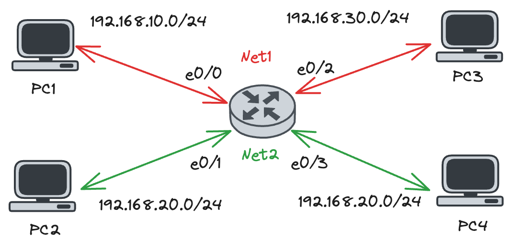
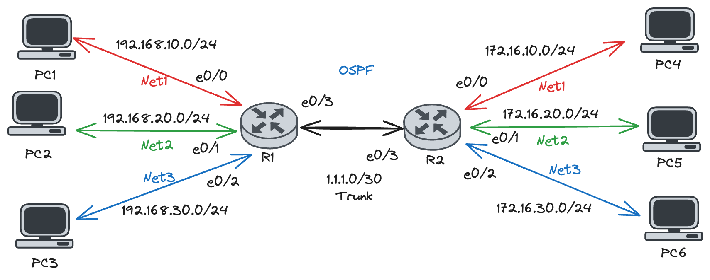

# Lab#1 - VRF Local



Pada lab kali ini akan melakukan konfigurasi VRF Local dengan membuat dua VRF instance yang berbeda:

- VRF net1 yang terhubung ke interface Ethernet0/0 dan Ethernet0/2
- VRF net2 yang terhubung ke interface Ethernet0/1 dan Ethernet0/3

## Configuration

1. Create VRF Instance
    
    ```bash
    ip vrf net1
    ip vrf net2
    ```
    
    - Tanpa RD (**Route Distinguisher)** VRF masih bisa berjalan di karenakan pada topologi ini menggunakan konsep VRF Local
2. Assign VRF Instance to Interface
    
    ```bash
    interface Ethernet0/0
     ip vrf forwarding net1
    
    interface Ethernet0/1
     ip vrf forwarding net2
    
    interface Ethernet0/2
     ip vrf forwarding net1
    
    interface Ethernet0/3
     ip vrf forwarding net2
    ```
    
3. Setting IP
    
    ```bash
    interface Ethernet0/0
     ip address 192.168.10.1 255.255.255.0
    
    interface Ethernet0/1
     ip address 192.168.20.1 255.255.255.0
    
    interface Ethernet0/2
     ip address 192.168.30.1 255.255.255.0
    
    interface Ethernet0/3
     ip address 192.168.40.1 255.255.255.0
    ```
    

## Check the results

- Check VRF
    
    ```bash
    router#show ip vrf interfaces 
    Interface              IP-Address      VRF                              Protocol
    Et0/0                  192.168.10.1    net1                             up      
    Et0/2                  192.168.30.1    net1                             up      
    Et0/1                  192.168.20.1    net2                             up      
    Et0/3                  192.168.40.1    net2
                                 up      
    router#show ip vrf            
      Name                             Default RD            Interfaces
      net1                             <not set>             Et0/0
                                                             Et0/2
      net2                             <not set>             Et0/1
                                                             Et0/3
    ```
    
- Ping
    
    ```bash
    # Ping via VRF Net1
    router#ping vrf net1 192.168.30.2
    Type escape sequence to abort.
    Sending 5, 100-byte ICMP Echos to 192.168.30.2, timeout is 2 seconds:
    !!!!!
    Success rate is 100 percent (5/5), round-trip min/avg/max = 1/1/1 ms
    router#ping vrf net1 192.168.10.2
    Type escape sequence to abort.
    Sending 5, 100-byte ICMP Echos to 192.168.10.2, timeout is 2 seconds:
    !!!!!
    Success rate is 100 percent (5/5), round-trip min/avg/max = 1/1/1 ms
    router#ping vrf net1 192.168.20.2
    Type escape sequence to abort.
    Sending 5, 100-byte ICMP Echos to 192.168.20.2, timeout is 2 seconds:
    .....
    Success rate is 0 percent (0/5)
    router#ping vrf net1 192.168.40.2
    Type escape sequence to abort.
    Sending 5, 100-byte ICMP Echos to 192.168.40.2, timeout is 2 seconds:
    .....
    Success rate is 0 percent (0/5)
    
    # Ping via VRF Net2
    router#ping vrf net2 192.168.20.2
    Type escape sequence to abort.
    Sending 5, 100-byte ICMP Echos to 192.168.20.2, timeout is 2 seconds:
    .!!!!
    Success rate is 80 percent (4/5), round-trip min/avg/max = 1/1/1 ms
    router#ping vrf net2 192.168.40.2
    Type escape sequence to abort.
    Sending 5, 100-byte ICMP Echos to 192.168.40.2, timeout is 2 seconds:
    .!!!!
    Success rate is 80 percent (4/5), round-trip min/avg/max = 1/1/1 ms
    router#ping vrf net2 192.168.10.2
    Type escape sequence to abort.
    Sending 5, 100-byte ICMP Echos to 192.168.10.2, timeout is 2 seconds:
    .....
    Success rate is 0 percent (0/5)
    router#ping vrf net2 192.168.30.2
    Type escape sequence to abort.
    Sending 5, 100-byte ICMP Echos to 192.168.30.2, timeout is 2 seconds:
    .....
    Success rate is 0 percent (0/5)
    ```
    
- Traceroute
    
    ```bash
    #Traceroute via VRF Net1
    
    router#traceroute vrf net1 192.168.30.2
    Type escape sequence to abort.
    Tracing the route to 192.168.30.2
    VRF info: (vrf in name/id, vrf out name/id)
      1 192.168.30.2 0 msec 0 msec 0 msec
    router#traceroute vrf net1 192.168.20.2
    Type escape sequence to abort.
    Tracing the route to 192.168.20.2
    VRF info: (vrf in name/id, vrf out name/id)
      1  *  *  * 
      2  *  *  * 
      3  *  *  * 
    
    #Traceroute via VRF Net2
    router#traceroute vrf net2 192.168.20.2
    Type escape sequence to abort.
    Tracing the route to 192.168.20.2
    VRF info: (vrf in name/id, vrf out name/id)
      1 192.168.20.2 0 msec 0 msec 0 msec
    router#traceroute vrf net2 192.168.30.2
    Type escape sequence to abort.
    Tracing the route to 192.168.30.2
    VRF info: (vrf in name/id, vrf out name/id)
      1  *  *  * 
      2  *  *  * 
      3  *  *  * 
    ```
    
- Check routing table
    
    ```bash
    #Routing table Main
    router#show ip route         
    
    Gateway of last resort is not set
    
    router#show ip route vrf net1
    
    Routing Table: net1
    Gateway of last resort is not set
    
          192.168.10.0/24 is variably subnetted, 2 subnets, 2 masks
    C        192.168.10.0/24 is directly connected, Ethernet0/0
    L        192.168.10.1/32 is directly connected, Ethernet0/0
          192.168.30.0/24 is variably subnetted, 2 subnets, 2 masks
    C        192.168.30.0/24 is directly connected, Ethernet0/2
    L        192.168.30.1/32 is directly connected, Ethernet0/2
    router#show ip route vrf net2
    
    Routing Table: net2
    Gateway of last resort is not set
    
          192.168.20.0/24 is variably subnetted, 2 subnets, 2 masks
    C        192.168.20.0/24 is directly connected, Ethernet0/1
    L        192.168.20.1/32 is directly connected, Ethernet0/1
          192.168.40.0/24 is variably subnetted, 2 subnets, 2 masks
    C        192.168.40.0/24 is directly connected, Ethernet0/3
    L        192.168.40.1/32 is directly connected, Ethernet0/3
    ```
    
    - Table routing global kenapa kosong?, di karenakan ip yang di assing sudah di masukan ke dalam instance VRF yang sudah di tentukan.

# Lab#2 - VRF + OSPF



Pada lab kali ini akan melakukan konfigurasi VRF lagi dengan membuat tiga VRF instance yang berbeda. Lalu untuk mengkoneksikan antar networknya menggunakan OSPF VRF di setiap instancenya.

## Configuration

1. Create VRF Instance
    
    ```bash
    #R1
    ip vrf net1
     rd 1.1.1.1:1
    
    ip vrf net2
     rd 1.1.1.1:2
    
    ip vrf net3
     rd 1.1.1.1:3
     
    #R2
    ip vrf net1
     rd 1.1.1.2:1
    !
    ip vrf net2
     rd 1.1.1.2:2
    !
    ip vrf net3
     rd 1.1.1.2:3
    
    ```
    
2. Assign VRF Instance to Interface
    
    ```bash
    #R1
    interface Ethernet0/0
     ip vrf forwarding net1
    
    interface Ethernet0/1
     ip vrf forwarding net2
    
    interface Ethernet0/2
     ip vrf forwarding net3
    
    interface Ethernet0/3.10
     ip vrf forwarding net1
    
    interface Ethernet0/3.20
     ip vrf forwarding net2
    
    interface Ethernet0/3.30
     ip vrf forwarding net3
    
    #R2
    interface Ethernet0/0
     ip vrf forwarding net1
    
    interface Ethernet0/1
     ip vrf forwarding net2
    
    interface Ethernet0/2
     ip vrf forwarding net3
    
    interface Ethernet0/3.10
     ip vrf forwarding net1
    
    interface Ethernet0/3.20
     ip vrf forwarding net2
    
    interface Ethernet0/3.30
     ip vrf forwarding net3
    ```
    
3. Setting IP
    
    ```bash
    #R1
    interface Ethernet0/0
     ip address 192.168.10.1 255.255.255.0
    
    interface Ethernet0/1
     ip address 192.168.20.1 255.255.255.0
    
    interface Ethernet0/2
     ip address 192.168.30.1 255.255.255.0
    
    interface Ethernet0/3.10
     encapsulation dot1Q 10
     ip address 1.1.1.1 255.255.255.252
     
    interface Ethernet0/3.20
     encapsulation dot1Q 20
     ip address 1.1.1.1 255.255.255.252
    
    interface Ethernet0/3.30
     encapsulation dot1Q 30
     ip address 1.1.1.1 255.255.255.252
    
    #R2
    interface Ethernet0/0
     ip address 172.16.10.1 255.255.255.0
    
    interface Ethernet0/1
     ip address 172.16.20.1 255.255.255.0
    
    interface Ethernet0/2
     ip address 172.16.30.1 255.255.255.0
    
    interface Ethernet0/3.10
     encapsulation dot1Q 10
     ip address 1.1.1.2 255.255.255.252
    
    interface Ethernet0/3.20
     encapsulation dot1Q 20
     ip address 1.1.1.2 255.255.255.252
    
    interface Ethernet0/3.30
     encapsulation dot1Q 30
     ip address 1.1.1.2 255.255.255.252
    ```
    
4. Setting Routing OSPF
    
    ```bash
    #R1
    router ospf 1 vrf net1
     network 1.1.1.0 0.0.0.3 area 0
     network 192.168.10.0 0.0.0.255 area 0
    
    router ospf 2 vrf net2
     network 1.1.1.0 0.0.0.3 area 0
     network 192.168.20.0 0.0.0.255 area 0
    
    router ospf 3 vrf net3
     network 1.1.1.0 0.0.0.3 area 0
     network 192.168.30.0 0.0.0.255 area 0
    
    #R2
    router ospf 1 vrf net1
     network 1.1.1.0 0.0.0.3 area 0
     network 172.16.10.0 0.0.0.255 area 0
    
    router ospf 2 vrf net2
     network 1.1.1.0 0.0.0.3 area 0
     network 172.16.20.0 0.0.0.255 area 0
    
    router ospf 3 vrf net3
     network 1.1.1.0 0.0.0.3 area 0
     network 172.16.30.0 0.0.0.255 area 0
    ```
    

## Check the results

- Check VRF
    
    ```bash
    #R1
    R1#show ip vrf 
      Name                             Default RD            Interfaces
      net1                             1.1.1.1:1             Et0/0
                                                             Et0/3.10
      net2                             1.1.1.1:2             Et0/1
                                                             Et0/3.20
      net3                             1.1.1.1:3             Et0/2
                                                             Et0/3.30
    R1#show ip vrf interfaces 
    Interface              IP-Address      VRF                              Protocol
    Et0/0                  192.168.10.1    net1                             up      
    Et0/3.10               1.1.1.1         net1                             up      
    Et0/1                  192.168.20.1    net2                             up      
    Et0/3.20               1.1.1.1         net2                             up      
    Et0/2                  192.168.30.1    net3                             up      
    Et0/3.30               1.1.1.1         net3                             up  
    
    #R2
    R2#show ip vrf 
      Name                             Default RD            Interfaces
      net1                             1.1.1.2:1             Et0/0
                                                             Et0/3.10
      net2                             1.1.1.2:2             Et0/1
                                                             Et0/3.20
      net3                             1.1.1.2:3             Et0/2
                                                             Et0/3.30
    R2#show ip vrf interfaces 
    Interface              IP-Address      VRF                              Protocol
    Et0/0                  172.16.10.1     net1                             up      
    Et0/3.10               1.1.1.2         net1                             up      
    Et0/1                  172.16.20.1     net2                             up      
    Et0/3.20               1.1.1.2         net2                             up      
    Et0/2                  172.16.30.1     net3                             up      
    Et0/3.30               1.1.1.2         net3                             up      
    ```
    
- Ping & Traceroute
    
    ```bash
    #R1
    R1#ping vrf net1 ip 172.16.10.2 source 192.168.10.1
    Type escape sequence to abort.
    Sending 5, 100-byte ICMP Echos to 172.16.10.2, timeout is 2 seconds:
    Packet sent with a source address of 192.168.10.1 
    !!!!!
    Success rate is 100 percent (5/5), round-trip min/avg/max = 1/1/2 ms
    
    R1#traceroute vrf net1 ip 172.16.10.2 source 192.168.10.1
    Type escape sequence to abort.
    Tracing the route to 172.16.10.2
    VRF info: (vrf in name/id, vrf out name/id)
      1 1.1.1.2 1 msec 1 msec 0 msec
      2 172.16.10.2 0 msec 1 msec 0 msec
    
    #R2
    R2#ping vrf net3 ip 192.168.30.2 source 172.16.30.1
    Type escape sequence to abort.
    Sending 5, 100-byte ICMP Echos to 192.168.30.2, timeout is 2 seconds:
    Packet sent with a source address of 172.16.30.1 
    !!!!!
    Success rate is 100 percent (5/5), round-trip min/avg/max = 1/1/2 ms
    
    R2#traceroute vrf net3 ip 192.168.30.2 source 172.16.30.1
    Type escape sequence to abort.
    Tracing the route to 192.168.30.2
    VRF info: (vrf in name/id, vrf out name/id)
      1 1.1.1.1 1 msec 0 msec 0 msec
      2 192.168.30.2 0 msec 0 msec 1 msec
    ```
    
- OSPF
    
    ```bash
    #R1
    R1#show ip ospf neighbor 
    
    Neighbor ID     Pri   State           Dead Time   Address         Interface
    172.16.30.1       1   FULL/BDR        00:00:31    1.1.1.2         Ethernet0/3.30
    172.16.20.1       1   FULL/BDR        00:00:39    1.1.1.2         Ethernet0/3.20
    172.16.10.1       1   FULL/BDR        00:00:31    1.1.1.2         Ethernet0/3.10
    
    #R2
    R2#show ip ospf neighbor 
    
    Neighbor ID     Pri   State           Dead Time   Address         Interface
    192.168.30.1      1   FULL/DR         00:00:38    1.1.1.1         Ethernet0/3.30
    192.168.40.1      1   FULL/DR         00:00:39    1.1.1.1         Ethernet0/3.20
    192.168.10.1      1   FULL/DR         00:00:38    1.1.1.1         Ethernet0/3.10
    ```
    
- Check routing table
    
    ```bash
    #R1
    R1#show ip route vrf net1
    
    Routing Table: net1
    
    Gateway of last resort is not set
    
          1.0.0.0/8 is variably subnetted, 2 subnets, 2 masks
    C        1.1.1.0/30 is directly connected, Ethernet0/3.10
    L        1.1.1.1/32 is directly connected, Ethernet0/3.10
          172.16.0.0/24 is subnetted, 1 subnets
    O        172.16.10.0 [110/20] via 1.1.1.2, 00:03:13, Ethernet0/3.10
          192.168.10.0/24 is variably subnetted, 2 subnets, 2 masks
    C        192.168.10.0/24 is directly connected, Ethernet0/0
    L        192.168.10.1/32 is directly connected, Ethernet0/0
    
    #R2
    R2#show ip route vrf net2
    
    Routing Table: net2
    
    Gateway of last resort is not set
    
          1.0.0.0/8 is variably subnetted, 2 subnets, 2 masks
    C        1.1.1.0/30 is directly connected, Ethernet0/3.20
    L        1.1.1.2/32 is directly connected, Ethernet0/3.20
          172.16.0.0/16 is variably subnetted, 2 subnets, 2 masks
    C        172.16.20.0/24 is directly connected, Ethernet0/1
    L        172.16.20.1/32 is directly connected, Ethernet0/1
    O     192.168.20.0/24 [110/20] via 1.1.1.1, 00:03:46, Ethernet0/3.20
    
    ```