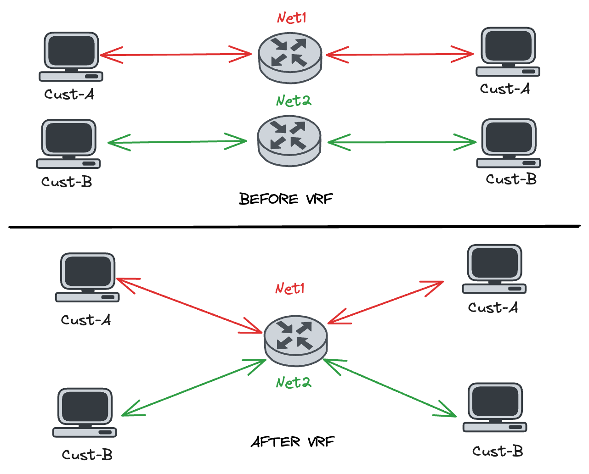

## 1. Pendahuluan VRF

Virtual Routing and Forwarding (VRF) adalah teknologi virtualisasi network yang memungkinkan beberapa instance routing table terpisah tetapi berjalan di perangkat jaringan yang sama. VRF memberikan kemampuan untuk memisahkan rute dan data antara berbagai network tanpa memerlukan hardware tambahan.

### **a. Tujuan dan Manfaat VRF**

- **Pemisahan Trafik:** Trafik dari berbagai jaringan dapat diisolasi secara logis, bahkan jika menggunakan perangkat yang sama karena VRF ini akan membuat beberapa routing table baru yang terpisah.
- **Keamanan Jaringan:** VRF memberikan isolasi trafik yang membantu mencegah kebocoran data.
- **Efisiensi Infrastruktur:** Mengurangi kebutuhan perangkat tambahan, mengoptimalkan pemanfaatan perangkat keras.
- **Fleksibilitas Operasional:** Mendukung multi-tenancy untuk jaringan perusahaan atau penyedia layanan.

### **b. Pengguna VRF**

- Jaringan penyedia layanan yang mendukung banyak pelanggan (multi-tenant).
- Isolasi jaringan dalam perusahaan untuk divisi atau aplikasi yang berbeda.
- Mendukung VPN Layer 3 di jaringan berbasis MPLS.

## **2. Dasar-Dasar VRF**

### **a. Istilah dalam VRF**

1. **VRF Instance**
    
    VRF instance adalah sebuah ruang logis pada router untuk memisahkan tabel routing. Dalam satu device, dapat dibuat beberapa VRF instance, yang masing-masing memiliki tabel routingnya sendiri.
    
    **Fungsi:**
    
    - Memisahkan trafik jaringan yang berbeda, meskipun menggunakan perangkat keras yang sama.
    - Menyediakan isolasi logis antar jaringan, memastikan bahwa data dari satu jaringan tidak bercampur dengan data dari jaringan lain.
    
    **Contoh:**
    
    Dalam sebuah perangkat router, Anda dapat membuat VRF bernama "CustomerA" untuk mengelola trafik dari pelanggan A dan "CustomerB" untuk pelanggan B. Keduanya memiliki tabel routing yang terisolasi sehingga rute dari "CustomerA" tidak terlihat oleh "CustomerB."
    
2. **Route Distinguisher (RD)**
    
    RD adalah sebuah identifier unik yang digunakan untuk membedakan rute di antara berbagai VRF. RD tidak memengaruhi proses routing itu sendiri, tetapi membantu perangkat untuk menjaga agar rute dari setiap VRF tetap unik. 
    
    **Format:**
    
    RD memiliki format **<Administrator>:<Assigned Number>**
    
    - **Administrator Field:** Sebuah nomor, biasanya berupa AS (Autonomous System) atau alamat IP.
    - **Assigned Number:** Sebuah angka unik untuk membedakan rute dalam VRF tersebut.
    
    **Contoh Format RD:**
    
    - **100:1**
    - **192.168.1.1:100**
    
    **Fungsi RD:**
    
    - Menambahkan "label" unik pada rute di jaringan yang mendukung VRF.
    - Membantu perangkat untuk mengenali rute mana yang milik VRF tertentu.
    - Isolasi Rute Antar-VRF:
        
        Jika dua VRF memiliki jaringan yang sama (misalnya `192.168.1.0/24`), RD membantu membedakan rute tersebut.
        
        - VRF A memiliki RD `100:1` → Rute ditandai sebagai `100:1:192.168.1.0/24`.
        - VRF B memiliki RD `100:2` → Rute ditandai sebagai `100:2:192.168.1.0/24`.Router tetap bisa memproses rute ini secara terpisah.
    - Mengkoneksikan network menggunakan MPLS, BGP dan antar  VRF sebagaia identitas VRFnya.
    - Tidak berfungsi untuk VRF Local
3. **Route Target (RT)**
    
    Atribut dalam protokol BGP yang digunakan untuk menentukan kebijakan distribusi rute antar-VRF. RT menentukan apakah rute dari satu VRF bisa diekspor (dibagikan) atau diimpor (digunakan) oleh VRF lain.
    
    **Fungsi RT:**
    
    - **Export RT:** Menandai rute yang akan diiklankan (ekspor) dari sebuah VRF ke VRF lain.
    - **Import RT:** Menentukan rute dari VRF lain yang dapat diterima (impor) oleh VRF tertentu.
    
    **Hubungan RD dan RT:**
    
    - **RD:** Membuat rute unik untuk VRF tertentu.
    - **RT:** Mengontrol distribusi rute tersebut ke VRF lain.
    
    **Contoh Penggunaan RT:**
    
    Misalnya, VRF "HR" memiliki rute yang perlu diakses oleh VRF "IT." Anda dapat mengonfigurasi:
    
    - VRF "HR" dengan **Export RT 100:10**.
    - VRF "IT" dengan **Import RT 100:10**.
    
    Dengan konfigurasi ini, rute dari VRF "HR" dapat diakses oleh VRF "IT."
    
4. **VRF Table**
    
    VRF table adalah tabel routing terpisah yang dibuat untuk setiap VRF instance. Tabel ini menyimpan rute khusus untuk trafik dalam VRF tersebut.
    
    **Fungsi:**
    
    - Mengatur rute secara terpisah untuk setiap VRF, memastikan isolasi antar jaringan.
    - Memungkinkan perangkat untuk mengetahui jalur mana yang harus digunakan untuk mengirimkan trafik.
    
    **Komponen dalam VRF Table:**
    
    - **Prefix:** Jaringan tujuan (misalnya, `192.168.10.0/24`).
    - **Next Hop:** Alamat IP berikutnya dalam jalur routing.
    - **Interface:** Port atau interface fisik/logis yang digunakan untuk mengirimkan trafik.

### **b. Tabel Routing dan Segmentasi dalam VRF**

VRF memungkinkan segmentasi tabel routing sehingga rute dari satu VRF tidak terlihat oleh VRF lain. Hal ini memastikan isolasi penuh antar jaringan.

### **c. Perbandingan dengan Routing Tradisional**

- **Routing Tradisional:** Semua rute dikumpulkan dalam satu tabel routing.
- **VRF:** Rute diisolasi ke tabel routing yang berbeda berdasarkan kebutuhan bisnis atau keamanan.

## 3. Contoh Konfigurasi

- **Contoh 1: Isolasi Rute Antar VRF**
    
    Misalnya, ada dua VRF:
    
    - **VRF_A** (RD: `100:1`, RT: `100:10`)
    - **VRF_B** (RD: `100:2`, RT: `100:20`)
    
    Tabel routing untuk masing-masing VRF:
    
    - **VRF_A:**
        
        ```bash
        #Configuration
        ip vrf VRF_A
          rd 192.168.1.1:1
        
        Destination   RD       Next Hop
        192.168.1.0   100:1    10.0.0.1
        
        ```
        
    - **VRF_B:**
        
        ```bash
        #Configuration
        ip vrf VRF_B
          rd 192.168.1.1:2
        
        Destination   RD       Next Hop
        192.168.1.0   100:2    10.0.0.2
        
        ```
    
    Rute `192.168.1.0/24` pada VRF_A dan VRF_B tidak akan saling memengaruhi karena memiliki RD yang berbeda.
    

- **Contoh 2: Inter-VRF Routing (Route Leaking) for BGP/MPLS**
    
    Misalnya, VRF_A membutuhkan akses ke jaringan di VRF_B. Anda dapat mengonfigurasi RT sebagai berikut:
    
    - **VRF_A Configuration:**
        
        ```bash
        ip vrf VRF_A
          rd 100:1
          route-target export 100:10
          route-target import 100:20
        
        ```
        
    - **VRF_B Configuration:**
        
        ```bash
        ip vrf VRF_B
          rd 100:2
          route-target export 100:20
          route-target import 100:10
        
        ```
        
    **Penjelasan:**
    
    - VRF_A mengekspor/membagikan routing tablenya dengan RT `100:10`.
    - VRF_B mengimpor/menerima routing table dari VRF_A dengan RT `100:10` dan mengekspor dengan RT `100:20`.
    - VRF_A mengimpor rute dari VRF_B menggunakan RT `100:20`.
    
    Lengkapnya bisa membuka materi MPLS-VPN
    
## 4. Troubleshoot

- `show ip vrf / show ip vrf detail` = Verifikasi Konfigurasi VRF mulai dari Nama instance VRF, RD, dan alokasi Interface VRF.
    
    ```bash
    router#show ip vrf 
      Name                             Default RD            Interfaces
      net1                             192.168.10.1:1        Et0/0
                                                             Et0/2
      net2                             192.168.20.1:1        Et0/1
                                                             Et0/3
    
    router#show ip vrf detail 
    VRF net1 (VRF Id = 1); default RD 192.168.10.1:1; default VPNID <not set>
      Old CLI format, supports IPv4 only
      Flags: 0xC
      Interfaces:
        Et0/0                    Et0/2                   
    Address family ipv4 unicast (Table ID = 0x3):
      Flags: 0x0
      No Export VPN route-target communities
      No Import VPN route-target communities
      No import route-map
      No global export route-map
      No export route-map
      VRF label distribution protocol: not configured
      VRF label allocation mode: per-prefix
    
    VRF net2 (VRF Id = 2); default RD 192.168.20.1:1; default VPNID <not set>
      Old CLI format, supports IPv4 only
      Flags: 0xC
      Interfaces:
        Et0/1                    Et0/3                   
    Address family ipv4 unicast (Table ID = 0x4):
      Flags: 0x0
      No Export VPN route-target communities
      No Import VPN route-target communities
      No import route-map
      No global export route-map
      No export route-map
      VRF label distribution protocol: not configured
      VRF label allocation mode: per-prefix 
    ```
    
- `show ip vrf [vrf-name]` = Check Table Routing VRF.
    
    ```bash
    router#show ip route vrf net1     
    Routing Table: net1
    Codes: L - local, C - connected, S - static, R - RIP, M - mobile, B - BGP
           D - EIGRP, EX - EIGRP external, O - OSPF, IA - OSPF inter area 
           N1 - OSPF NSSA external type 1, N2 - OSPF NSSA external type 2
           E1 - OSPF external type 1, E2 - OSPF external type 2
           i - IS-IS, su - IS-IS summary, L1 - IS-IS level-1, L2 - IS-IS level-2
           ia - IS-IS inter area, * - candidate default, U - per-user static route
           o - ODR, P - periodic downloaded static route, H - NHRP, l - LISP
           a - application route
           + - replicated route, % - next hop override
    
    Gateway of last resort is not set
    
          192.168.10.0/24 is variably subnetted, 2 subnets, 2 masks
    C        192.168.10.0/24 is directly connected, Ethernet0/0
    L        192.168.10.1/32 is directly connected, Ethernet0/0
          192.168.30.0/24 is variably subnetted, 2 subnets, 2 masks
    C        192.168.30.0/24 is directly connected, Ethernet0/2
    L        192.168.30.1/32 is directly connected, Ethernet0/2
    ```
    
- `show ip arp vrf [vrf-name]` = Check ARP VRF.
    
    ```bash
    router#show ip arp vrf net1
    Protocol  Address          Age (min)  Hardware Addr   Type   Interface
    Internet  192.168.10.1            -   aabb.cc00.0500  ARPA   Ethernet0/0
    Internet  192.168.10.2            6   0050.7966.6888  ARPA   Ethernet0/0
    Internet  192.168.30.1            -   aabb.cc00.0520  ARPA   Ethernet0/2
    Internet  192.168.30.2            6   0050.7966.6893  ARPA   Ethernet0/2
    ```
    
- `ping vrf [vrf-name] ip [dest-ip]` 
`traceroute vrf [vrf-name] ip [dest-ip]`= Check Connection via VRF.
    
    ```bash
    router#ping vrf net1 ip 192.168.30.2
    Type escape sequence to abort.
    Sending 5, 100-byte ICMP Echos to 192.168.30.2, timeout is 2 seconds:
    !!!!!
    Success rate is 100 percent (5/5), round-trip min/avg/max = 1/1/1 ms
    
    router#traceroute vrf net1 ip 192.168.30.2
    Type escape sequence to abort.
    Tracing the route to 192.168.30.2
    VRF info: (vrf in name/id, vrf out name/id)
      1 192.168.30.2 1 msec 0 msec 0 msec
    ```